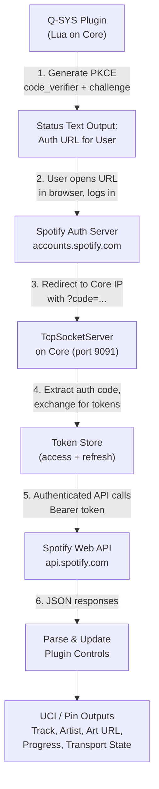

# Spotify Controller Q-SYS Plugin — Implementation Plan

> **Plugin Name:** `Spotify_Playback_Controller.qplug`  
> **Author:** Dustin Bennett — TEL Systems  
> **Target:** Q-SYS Designer 9.x+

---

## Executive Summary

This plugin will allow a Q-SYS system to authenticate against a Spotify account via the **Authorization Code flow with PKCE** (no client_secret stored on the Core), poll the currently-playing track, display album artwork on a UCI via Media Display, and give full transport control (play, pause, next, previous, shuffle, repeat, volume, seek). The token lifecycle (access + refresh) will be managed entirely inside the plugin with automatic renewal.

---

## Architecture Overview



---

## Phase 0 — Prerequisites (Manual, One-Time)

| Step | Action |
|------|--------|
| 0.1 | Go to [Spotify Developer Dashboard](https://developer.spotify.com/dashboard) and create an App |
| 0.2 | Note the **Client ID** (public, safe to store in plugin properties) |
| 0.3 | Add a Redirect URI: `http://<Core_IP>:9091/callback` (HTTP is allowed for non-loopback only in Dev Mode; for production register the Core's FQDN with HTTPS if required) |
| 0.4 | Request the following scopes: `user-read-playback-state user-modify-playback-state user-read-currently-playing` |

> [!IMPORTANT]
> The **Client Secret is NOT needed** — PKCE eliminates the requirement entirely, which is ideal for an embedded device like Q-SYS Core.

---

## Phase 1 — Plugin Skeleton & Properties

### 1.1 PluginInfo Block
```lua
PluginInfo = {
  Name = "Spotify Playback Controller",
  Version = "1.0.0",
  BuildVersion = "1.0.0.0",
  Id = "dstn.qsys.spotify-playback-controller",
  Author = "Dustin Bennett - Telsystems",
  Description = "Full Spotify playback control with OAuth PKCE auth, now-playing metadata, album art, and transport controls."
}
```

### 1.2 Properties
| Property | Type | Purpose |
|----------|------|---------|
| `Client ID` | string | Spotify App Client ID |
| `Redirect Port` | integer (default 9091) | Port the TcpSocketServer listens on for OAuth callback |
| `Poll Interval (s)` | integer enum {1,2,3,5,10} default 3 | How often to poll currently-playing |

### 1.3 Plugin Color
Spotify green: `{30, 215, 96}`

---

## Phase 2 — Controls Definition (`GetControls`)

### Authentication Group
| Control Name | Type | Direction | Purpose |
|---|---|---|---|
| `Auth_URL` | Text | Output | Full authorization URL the user must open in a browser |
| `Auth_Code_Input` | Text | Input | Manual paste fallback if TcpSocketServer can't catch redirect |
| `Authorize` | Button/Trigger | Input | Initiates a fresh PKCE auth flow |
| `Logout` | Button/Trigger | Input | Clears tokens, stops polling |
| `Auth_Status` | Indicator | Output | LED: Red=Logged Out, Yellow=Authorizing, Green=Authenticated |
| `User_Name` | Text | Output | Authenticated Spotify display name |

### Transport Controls Group
| Control Name | Type | Direction | Purpose |
|---|---|---|---|
| `Play` | Button/Trigger | Input | PUT `/me/player/play` |
| `Pause` | Button/Trigger | Input | PUT `/me/player/pause` |
| `Next` | Button/Trigger | Input | POST `/me/player/next` |
| `Previous` | Button/Trigger | Input | POST `/me/player/previous` |
| `Shuffle` | Button/Toggle | Both | PUT `/me/player/shuffle?state=` |
| `Repeat` | Button/Momentary | Input | Cycles: off → context → track → off |
| `Repeat_State` | Text | Output | Current repeat mode string |
| `Is_Playing` | Indicator | Output | Boolean — is playback active |

### Now-Playing Metadata Group
| Control Name | Type | Direction | Purpose |
|---|---|---|---|
| `Track_Name` | Text | Output | Current track name |
| `Artist_Name` | Text | Output | Comma-joined artist names |
| `Album_Name` | Text | Output | Album name |
| `Album_Art_URL` | Text | Output | HTTPS image URL (fed into UCI Media Display) |
| `Progress_Ms` | Knob (0–100%) | Output | Current position as percentage of duration |
| `Progress_Text` | Text | Output | `"2:34 / 4:12"` formatted |
| `Duration_Ms` | Text | Output | Raw duration for external use |

### Volume & Device Group
| Control Name | Type | Direction | Purpose |
|---|---|---|---|
| `Volume` | Knob (0–100) | Both | GET/PUT volume_percent |
| `Active_Device` | Text | Output | Name of active Spotify Connect device |
| `Device_ID` | Text | Output | Hidden/debug — active device id |

### Seek Control
| Control Name | Type | Direction | Purpose |
|---|---|---|---|
| `Seek_Position` | Knob (0–100%) | Input | Seek to percentage of track |

---

## Phase 3 — Control Layout (`GetControlLayout`)

Visual layout organized in horizontal sections (matching your existing plugin style):

```
┌──────────────────────────────────────────────────────────────┐
│  HEADER: "Spotify Playback Controller"                       │
├──────────────────────────────────────────────────────────────┤
│  Auth Section                                                │
│  [Authorize] [Logout]  ●Auth_Status   User: <User_Name>     │
│  Auth URL: <readonly text field spanning full width>         │
├──────────────────────────────────────────────────────────────┤
│  Now Playing                                                 │
│  Track: <Track_Name>                                         │
│  Artist: <Artist_Name>                                       │
│  Album: <Album_Name>                                         │
│  Art URL: <Album_Art_URL>         Progress: <Progress_Text>  │
├──────────────────────────────────────────────────────────────┤
│  Transport                                                   │
│  [|◁] [▶/❚❚] [▷|]   [🔀 Shuffle] [🔁 Repeat]  ●IsPlaying  │
├──────────────────────────────────────────────────────────────┤
│  Volume & Device                                             │
│  Volume: ════════════════  Device: <Active_Device>           │
└──────────────────────────────────────────────────────────────┘
```

---

## Phase 4 — OAuth PKCE Authentication Engine

This is the most complex phase. All Lua code runs inside `if Controls then ... end`.

### 4.1 PKCE Code Verifier & Challenge Generation

```lua
-- Generate a 64-character random code verifier
local function generate_code_verifier()
  local chars = "ABCDEFGHIJKLMNOPQRSTUVWXYZabcdefghijklmnopqrstuvwxyz0123456789-._~"
  local result = {}
  for i = 1, 64 do
    local idx = math.random(1, #chars)
    table.insert(result, chars:sub(idx, idx))
  end
  return table.concat(result)
end

-- SHA256 hash → Base64url encode (no padding, + → -, / → _)
local function generate_code_challenge(verifier)
  local hash = Crypto.Digest("sha256", verifier)  -- returns hex string
  -- Convert hex to raw bytes
  local raw = hash:gsub("..", function(cc)
    return string.char(tonumber(cc, 16))
  end)
  local b64 = Crypto.Base64Encode(raw, false)  -- no padding
  b64 = b64:gsub("+", "-"):gsub("/", "_")
  return b64
end
```

### 4.2 Authorization URL Construction

Build and display the full URL the user must open in a browser:

```
https://accounts.spotify.com/authorize?
  client_id=<CLIENT_ID>
  &response_type=code
  &redirect_uri=http://<CORE_IP>:<PORT>/callback
  &scope=user-read-playback-state user-modify-playback-state user-read-currently-playing
  &code_challenge_method=S256
  &code_challenge=<CHALLENGE>
```

The URL is placed into `Controls.Auth_URL.String` for the user to copy/open.

### 4.3 TcpSocketServer — Catch the OAuth Redirect

```lua
local auth_server = TcpSocketServer.New()
auth_server.EventHandler = function(socket)
  socket.EventHandler = function(sock, evt)
    if evt == TcpSocket.Events.Data then
      local data = sock:Read(sock.BufferLength)
      local code = data:match("[?&]code=([^&%s]+)")
      if code then
        -- Send friendly HTML response to browser
        local html = "<html><body><h1>✅ Spotify Authorized!</h1>"
            .. "<p>You can close this tab and return to Q-SYS.</p></body></html>"
        local resp = "HTTP/1.1 200 OK\r\n"
            .. "Content-Type: text/html\r\n"
            .. "Content-Length: " .. #html .. "\r\n"
            .. "Connection: close\r\n\r\n" .. html
        sock:Write(resp)
        Timer.CallAfter(function() sock:Disconnect() end, 0.5)
        -- Exchange code for tokens
        exchange_code_for_token(code)
      end
    end
  end
end
auth_server:Listen(REDIRECT_PORT)
```

### 4.4 Token Exchange (POST to `/api/token`)

```lua
local function exchange_code_for_token(code)
  local body = "client_id=" .. CLIENT_ID
    .. "&grant_type=authorization_code"
    .. "&code=" .. code
    .. "&redirect_uri=" .. url_encode(REDIRECT_URI)
    .. "&code_verifier=" .. code_verifier
  HttpClient.Upload({
    Url = "https://accounts.spotify.com/api/token",
    Method = "POST",
    Headers = { ["Content-Type"] = "application/x-www-form-urlencoded" },
    Data = body,
    EventHandler = function(tbl, http_code, data, err, hdrs)
      if http_code == 200 then
        local json = rapidjson.decode(data)
        access_token = json.access_token
        refresh_token = json.refresh_token
        token_expiry = os.time() + (json.expires_in or 3600)
        -- Start polling, update status
        start_polling()
        fetch_user_profile()
      end
    end
  })
end
```

### 4.5 Token Refresh (Automatic)

A `Timer.CallAfter` schedules refresh 60 seconds before expiry:

```lua
local function refresh_access_token()
  local body = "client_id=" .. CLIENT_ID
    .. "&grant_type=refresh_token"
    .. "&refresh_token=" .. refresh_token
  HttpClient.Upload({
    Url = "https://accounts.spotify.com/api/token",
    Method = "POST",
    Headers = { ["Content-Type"] = "application/x-www-form-urlencoded" },
    Data = body,
    EventHandler = function(tbl, http_code, data, err, hdrs)
      if http_code == 200 then
        local json = rapidjson.decode(data)
        access_token = json.access_token
        if json.refresh_token then refresh_token = json.refresh_token end
        token_expiry = os.time() + (json.expires_in or 3600)
        schedule_token_refresh()
      end
    end
  })
end

local function schedule_token_refresh()
  local delay = math.max((token_expiry - os.time()) - 60, 10)
  Timer.CallAfter(refresh_access_token, delay)
end
```

---

## Phase 5 — Spotify Web API Integration

### 5.1 Generic API Request Helper

```lua
local function spotify_api(method, endpoint, body_data, callback)
  if not access_token then return end
  -- Auto-refresh if token expired
  if os.time() >= token_expiry then
    refresh_access_token()
    Timer.CallAfter(function() spotify_api(method, endpoint, body_data, callback) end, 2)
    return
  end
  local url = "https://api.spotify.com/v1" .. endpoint
  local headers = {
    ["Authorization"] = "Bearer " .. access_token,
    ["Content-Type"] = "application/json"
  }
  if method == "GET" then
    HttpClient.Download({
      Url = url, Headers = headers, Timeout = 10,
      EventHandler = function(t, code, data, err, h)
        if code == 401 then refresh_access_token() return end
        if callback then callback(code, data) end
      end
    })
  else
    HttpClient.Upload({
      Url = url, Method = method, Headers = headers,
      Data = body_data or "", Timeout = 10,
      EventHandler = function(t, code, data, err, h)
        if code == 401 then refresh_access_token() return end
        if callback then callback(code, data) end
      end
    })
  end
end
```

### 5.2 Polling — Currently Playing Track

```lua
local poll_timer = Timer.New()

local function poll_now_playing()
  spotify_api("GET", "/me/player", nil, function(code, data)
    if code == 200 and data and #data > 0 then
      local state = rapidjson.decode(data)
      if state and state.item then
        Controls.Track_Name.String  = state.item.name or ""
        Controls.Album_Name.String  = (state.item.album or {}).name or ""
        Controls.Is_Playing.Boolean = state.is_playing or false
        -- Artists
        local artists = {}
        for _, a in ipairs(state.item.artists or {}) do
          table.insert(artists, a.name)
        end
        Controls.Artist_Name.String = table.concat(artists, ", ")
        -- Album Art (largest image)
        local images = (state.item.album or {}).images or {}
        Controls.Album_Art_URL.String = images[1] and images[1].url or ""
        -- Progress
        local prog = state.progress_ms or 0
        local dur  = state.item.duration_ms or 1
        Controls.Progress_Ms.Position = prog / dur
        Controls.Progress_Text.String = format_ms(prog) .. " / " .. format_ms(dur)
        Controls.Duration_Ms.String   = tostring(dur)
        -- Shuffle / Repeat
        Controls.Shuffle.Boolean      = state.shuffle_state or false
        Controls.Repeat_State.String  = state.repeat_state or "off"
        -- Volume
        if state.device then
          Controls.Volume.Value       = state.device.volume_percent or 0
          Controls.Active_Device.String = state.device.name or ""
          Controls.Device_ID.String   = state.device.id or ""
        end
      end
    elseif code == 204 then
      -- Nothing playing
      Controls.Track_Name.String  = ""
      Controls.Artist_Name.String = ""
      Controls.Is_Playing.Boolean = false
    end
  end)
end

local function start_polling()
  poll_timer:Stop()
  poll_timer.EventHandler = poll_now_playing
  poll_timer:Start(POLL_INTERVAL)
  poll_now_playing() -- immediate first call
end
```

### 5.3 Transport Control Handlers

```lua
Controls.Play.EventHandler = function()
  spotify_api("PUT", "/me/player/play", nil, function() poll_now_playing() end)
end
Controls.Pause.EventHandler = function()
  spotify_api("PUT", "/me/player/pause", nil, function() poll_now_playing() end)
end
Controls.Next.EventHandler = function()
  spotify_api("POST", "/me/player/next", nil, function()
    Timer.CallAfter(poll_now_playing, 0.5)
  end)
end
Controls.Previous.EventHandler = function()
  spotify_api("POST", "/me/player/previous", nil, function()
    Timer.CallAfter(poll_now_playing, 0.5)
  end)
end
Controls.Shuffle.EventHandler = function(ctrl)
  local state = ctrl.Boolean and "true" or "false"
  spotify_api("PUT", "/me/player/shuffle?state=" .. state)
end
Controls.Repeat.EventHandler = function()
  local cycle = { off = "context", context = "track", track = "off" }
  local next_state = cycle[Controls.Repeat_State.String] or "off"
  spotify_api("PUT", "/me/player/repeat?state=" .. next_state)
end
Controls.Volume.EventHandler = function(ctrl)
  local vol = math.floor(ctrl.Value)
  spotify_api("PUT", "/me/player/volume?volume_percent=" .. vol)
end
Controls.Seek_Position.EventHandler = function(ctrl)
  local dur = tonumber(Controls.Duration_Ms.String) or 0
  if dur > 0 then
    local pos_ms = math.floor(ctrl.Position * dur)
    spotify_api("PUT", "/me/player/seek?position_ms=" .. pos_ms)
  end
end
```

---

## Phase 6 — Album Art on UCI (Media Display)

The `Album_Art_URL` control outputs a string like:
```
https://i.scdn.co/image/ab67616d0000b273...
```

**UCI Setup (manual in Q-SYS Designer):**
1. Drag the `Album_Art_URL` control onto the UCI
2. Set its **Presentation** to **Media Display**
3. The UCI will automatically download and render the album cover image from the Spotify CDN
4. The image updates every poll cycle when the track changes

> [!TIP]
> Use a 300×300 or similar square region on the UCI for album art. Spotify provides images at 640×640, 300×300, and 64×64 — the plugin grabs the largest.

---

## Phase 7 — Utility Functions

```lua
-- Format milliseconds to "M:SS"
local function format_ms(ms)
  local total_sec = math.floor(ms / 1000)
  local min = math.floor(total_sec / 60)
  local sec = total_sec % 60
  return string.format("%d:%02d", min, sec)
end

-- URL-encode a string
local function url_encode(str)
  return str:gsub("([^%w%-%.%_%~])", function(c)
    return string.format("%%%02X", string.byte(c))
  end)
end

-- Fetch authenticated user profile for display
local function fetch_user_profile()
  spotify_api("GET", "/me", nil, function(code, data)
    if code == 200 then
      local profile = rapidjson.decode(data)
      Controls.User_Name.String = profile.display_name or profile.id or ""
      Controls.Auth_Status.Value = 1  -- Green
    end
  end)
end
```

---

## Phase 8 — Error Handling & Edge Cases

| Scenario | Handling |
|----------|----------|
| Token expires mid-session | Auto-refresh 60s before expiry; 401 responses trigger immediate refresh |
| No active device | `code == 404` on transport commands → show "No active device" in `Active_Device` |
| Rate limiting (429) | Read `Retry-After` header, back off polling interval temporarily |
| Network loss | Wrap all HTTP calls in pcall; show error state on `Auth_Status` indicator |
| User logs out | Clear all tokens, stop poll timer, reset all controls to blank |
| Core reboot | Tokens are volatile (lost on reboot); user must re-authorize. Future enhancement: persist refresh_token via Named Controls or external file |
| Nothing playing (204) | Clear track metadata, show idle state |

---

## Phase 9 — Implementation Task Order

- [ ] **Task 1:** Create plugin file with `PluginInfo`, `GetColor`, `GetPrettyName`, `GetProperties`
- [ ] **Task 2:** Implement `GetControls` with all control definitions from Phase 2
- [ ] **Task 3:** Implement `GetControlLayout` with headers and positioning from Phase 3
- [ ] **Task 4:** Implement PKCE generation (code verifier + challenge) — Phase 4.1–4.2
- [ ] **Task 5:** Implement TcpSocketServer for OAuth redirect — Phase 4.3
- [ ] **Task 6:** Implement token exchange and refresh — Phase 4.4–4.5
- [ ] **Task 7:** Implement generic `spotify_api()` helper — Phase 5.1
- [ ] **Task 8:** Implement now-playing poller and metadata parsing — Phase 5.2
- [ ] **Task 9:** Implement all transport control EventHandlers — Phase 5.3
- [ ] **Task 10:** Implement utility functions — Phase 7
- [ ] **Task 11:** Implement error handling and edge cases — Phase 8
- [ ] **Task 12:** End-to-end testing on Q-SYS Core with real Spotify account
- [ ] **Task 13:** UCI layout with Media Display for album art — Phase 6

---

## Key Technical Decisions

| Decision | Rationale |
|----------|-----------|
| **PKCE over standard Auth Code** | No `client_secret` stored on device — best practice for embedded/public clients |
| **TcpSocketServer for redirect** | Eliminates need for external proxy; Core catches the browser redirect directly |
| **Polling over WebSocket** | Spotify doesn't offer WebSocket push; polling at 3s intervals is their recommended pattern |
| **`rapidjson` for JSON** | Built into Q-SYS Lua environment — no external dependencies |
| **`Crypto.Digest` for SHA256** | Native Q-SYS Lua extension — no external crypto libs needed |
| **Media Display for album art** | Native UCI feature — just feed it a URL string and it renders the image |

---

## Spotify API Endpoints Used

| Endpoint | Method | Scope Required | Purpose |
|----------|--------|----------------|---------|
| `/authorize` | GET | — | User authorization |
| `/api/token` | POST | — | Token exchange & refresh |
| `/v1/me` | GET | — | User profile |
| `/v1/me/player` | GET | `user-read-playback-state` | Full playback state |
| `/v1/me/player/play` | PUT | `user-modify-playback-state` | Resume playback |
| `/v1/me/player/pause` | PUT | `user-modify-playback-state` | Pause playback |
| `/v1/me/player/next` | POST | `user-modify-playback-state` | Skip to next |
| `/v1/me/player/previous` | POST | `user-modify-playback-state` | Skip to previous |
| `/v1/me/player/shuffle` | PUT | `user-modify-playback-state` | Toggle shuffle |
| `/v1/me/player/repeat` | PUT | `user-modify-playback-state` | Set repeat mode |
| `/v1/me/player/volume` | PUT | `user-modify-playback-state` | Set volume |
| `/v1/me/player/seek` | PUT | `user-modify-playback-state` | Seek to position |

---

## Future Enhancements (Post-v1)

- **Persist refresh_token** to survive Core reboots (write to media storage or Named Control)
- **Playlist browsing** — list user playlists, start playback of a specific playlist
- **Search** — search Spotify catalog and queue tracks
- **Device selection** — list available Spotify Connect devices and transfer playback
- **Multiple accounts** — support multiple Spotify logins for different zones
- **QR Code generation** — display a QR code on UCI for the auth URL so users can scan with phone
